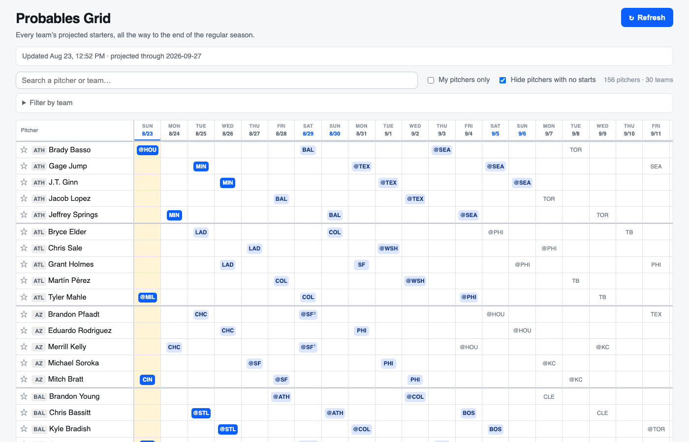

# Probables Grid

A calendar grid of every MLB club's starting pitchers, projected **through the end of the
regular season** — not just the ten days the free sites announce.

Runs entirely in the browser as a static page. No server, no build step, no API key,
free to host on GitHub Pages.



## Why

[RotoWire](https://www.rotowire.com/baseball/projected-starters.php) and the
[FanGraphs RosterResource Probables Grid](https://www.fangraphs.com/roster-resource/probables-grid)
both stop about ten days out — at most the next two starts for any pitcher. Sites that
project further out charge for it. This fills that gap, in the
[schedule-grid](https://www.fangraphs.com/roster-resource/schedule-grid) layout, with every
pitcher on one page and a refresh button.

## How the projection works

Clubs announce starters roughly ten days ahead. Past that the grid works it out:

1. **Infer the rotation.** Take the club's known starts — completed games *and* already
   announced probables — over the last three weeks. The most recent five distinct starters,
   ordered by when they last pitched, are the cycle. Whoever pitched longest ago is next up.
2. **Walk it forward.** Advance one slot per **game**, not per calendar day. That is the same
   thing as "a starter every fifth day" during a normal week, but it stays correct through
   off-days, doubleheaders and postponements, because the schedule supplies the dates.
3. **Let announcements win.** An announced starter is printed as-is and the cycle re-anchors
   around it, so a skipped turn or an injury correction propagates to everything downstream.
4. **Admit what it cannot know.** A club cannot start the same pitcher twice inside one turn.
   Where the schedule holds more games than the cycle can absorb, the extra game is marked
   **TBD** rather than filled with a start we know to be impossible.

Two details worth knowing:

- **Every club is a five-man rotation except the Dodgers, who run six.** That lives in
  [`js/config.js`](js/config.js) as `ROTATION_SIZE_BY_TEAM` — one line to change when another
  club switches.
- **Stale arms fall out on their own.** A starter who stops taking turns drops out of the
  three-week window without needing an injury feed. Injured-list status is applied on top of
  that, from the club rosters.

## How accurate is it?

Backtested against four anchor dates in July and August 2026 — starting the model at a past
date, projecting forward blind, and scoring against what actually happened. Roughly 570
starts scored per anchor:

| Horizon | Accuracy | Random guess |
| --- | --- | --- |
| Days 1–7 | 49.5–56.9% | 20% |
| Days 8–14 | 34.0–43.0% | 20% |
| Days 15–21 | 29.6–33.0% | 20% |

Run it yourself:

```bash
node tests/backtest.mjs 2026-08-02
```

Those figures are the **model alone**, with announcements switched off. In normal use the
first ten days are mostly announced fact, so the near columns are far better than this table
suggests and the projection only carries the far ones.

Be honest about the right-hand side of the grid: injuries, call-ups, trades and September
roster expansion all break a fixed cycle. Treat the far columns as a planning aid, not a
promise.

## Running it

Any static file server works — ES modules need HTTP, so opening `index.html` off the
filesystem will not work.

```bash
python3 -m http.server 8123
```

Then open <http://localhost:8123>.

## Deploying to GitHub Pages

Free on a public repo:

1. Push to GitHub.
2. **Settings → Pages → Build and deployment → Deploy from a branch**, branch `main`, folder `/ (root)`.
3. The site appears at `https://<user>.github.io/<repo>/` within a minute or so.

Nothing else to configure. The page calls `statsapi.mlb.com` directly from the browser —
the API sends `Access-Control-Allow-Origin: *`, which is what makes a backend unnecessary.

### The fallback snapshot

[`.github/workflows/snapshot.yml`](.github/workflows/snapshot.yml) runs every three hours,
bakes the same data into `data/snapshot.json` and commits it when it changes. If the live
call fails, the page loads that instead and says so in the status bar. Build one by hand with:

```bash
python3 scripts/snapshot.py
```

## Using the grid

- **Refresh** re-pulls the schedule and probables; the status bar shows when it last updated.
- **Search** matches pitcher or team, and ignores accents — `rodon` finds *Rodón*.
- **★** stars a pitcher; **My pitchers only** narrows to your list. Saved in the browser.
- **Filter by team** limits the grid to the clubs you pick.
- Cells read `SEA` for home, `@SEA` for away. A superscript marks a doubleheader game.
  Solid blue is announced, light blue projected, grey a long-range projection, dashed a TBD.

## Layout

| Path | Purpose |
| --- | --- |
| [`index.html`](index.html) | Page shell |
| [`js/config.js`](js/config.js) | Rotation sizes, lookback window, thresholds |
| [`js/api.js`](js/api.js) | MLB Stats API client and snapshot fallback |
| [`js/rotation.js`](js/rotation.js) | Rotation inference and projection — pure, testable |
| [`js/grid.js`](js/grid.js) | Rendering |
| [`js/filters.js`](js/filters.js) | Search, team filter, saved pitcher list |
| [`js/app.js`](js/app.js) | Wiring |
| [`scripts/snapshot.py`](scripts/snapshot.py) | Fallback snapshot builder |
| [`tests/`](tests/) | Unit tests and the backtest harness |

## Tests

```bash
node --test tests/rotation.test.mjs
```

Covers rotation inference against a known cycle, stale-arm and injury exclusion, spot
starters, the Dodgers' six-man cycle, doubleheaders, the duplicate entry the feed emits for
postponed games, TBD handling, and the filters.

## Data

[MLB Stats API](https://statsapi.mlb.com/). Not affiliated with or endorsed by MLB.
